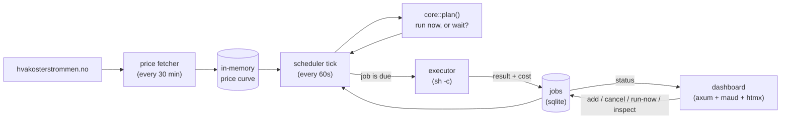

# spotwatt

A power-price-aware compute scheduler for a homelab. It moves heavy,
non-urgent work — backups, video transcoding, model training — to the cheapest
hours of the day using Norwegian spot prices (Nord Pool via
[hvakosterstrommen.no](https://www.hvakosterstrommen.no)).

If you just want the architecture, jump to [How it fits together](#how-it-fits-together).
Otherwise, here's the whole idea in plain terms first.

---

## The problem

You have a server that runs around the clock. Electricity costs a different
amount every hour (the spot price). At night and in the middle of the day it's
often cheap; in the morning and evening it's expensive. The gap can be large.

A lot of what the server does isn't urgent. A backup, a video conversion, a
training run for an AI model — it doesn't matter whether it runs at 14:00 or at
03:00, as long as it finishes. But most people kick off jobs like that the
moment they think of them, and pay the expensive price for no reason.

## The idea

You stop saying *"run this job now."* You say *"run this job when electricity is
cheapest, but it has to be done before 07:00."*

The program looks at the prices, finds the cheapest window, and starts the job
itself at the right moment. You don't have to think about it.

## The principle (the important part)

There's a catch: the price list only goes 24–48 hours ahead. You don't know what
electricity costs on Thursday when it's Monday (tomorrow's prices publish around
13:00).

So the program does **not** build a fixed plan far into the future. Instead it
asks itself one question, over and over, once a minute:

> *"Based on the prices I know right now, is this hour the right time to start
> the job?"*

If the answer is no, it does nothing and asks again in a minute. If a cheaper
hour shows up, or tomorrow's prices arrive with a better window, that's caught
automatically the next time it asks. If the deadline is getting close and time
is running out, it starts anyway.

That's the whole trick. Instead of deciding once, it makes the same small
decision continuously — so it never has to guess about the future.

## How it fits together

Think of it as four parts talking to each other:



1. **The fetcher** asks hvakosterstrommen.no every 30 minutes and keeps a fresh
   price curve in memory.
2. **The brain** (`core::plan()`) is a small function that takes the prices, the
   job, and the clock, and answers *"run now"* or *"wait until then."* It's
   completely isolated and does nothing else, so it's easy to test — that's the
   part with 9 unit tests.
3. **The scheduler** wakes the brain every 60 seconds for each pending job and
   launches the ones that are due.
4. **The executor** runs the actual command, captures its output, whether it
   succeeded, and what it actually cost in kroner.

On top of it all sits a web dashboard where you add jobs and watch status; it
refreshes itself every few seconds.

## Scheduling policies

You pick one of three ways for a job to wait:

- **Cheapest window** — find the cheapest contiguous block of hours long enough
  to fit the job, optionally finishing before a deadline. The workhorse, for
  backups, conversions, training.
- **Below threshold** — run as soon as the price drops to/below a kr/kWh limit.
  Simple and predictable.
- **Immediate** — run now regardless of price, for things you can't defer.

Priority (low/normal/high/critical) breaks ties when the concurrency cap forces
a choice; deadlines break ties after that.

Any policy can also **repeat daily** — on completion the job re-queues itself for
the next day with its deadline rolled forward 24h, so "nightly backup before
07:00" is genuinely nightly rather than single-shot.

## Pricing what you actually pay

Bare Nord Pool spot is *not* the number on a Norwegian bill, so scheduling
against it optimizes the wrong thing. spotwatt plans and costs against the
**effective consumer price**: `energy + grid energy + electricity tax`, all
under VAT. The energy part depends on your deal:

- **spot + strømstøtte** (default): the refund flattens the expensive end of
  the curve, which changes which hours are really cheapest;
- **Norgespris** (`energy_model = "norgespris"`): the fixed state price makes
  the spot curve irrelevant — the only per-hour signal left is the grid rent's
  cheaper night/weekend rate, and spotwatt schedules on exactly that.

The grid energy rate itself is time-differentiated (day vs night/weekend), as
with most Norwegian grid operators. Tune everything in `[tariff]`
(`config.example.toml`); zero it out / `subsidy_rate = 0` to optimize bare spot
instead. The dashboard also keeps an honest running total of estimated kroner
saved versus starting every job the moment it was submitted — measured against
the effective tariff, so it won't flatter itself.

## Peak-shaving (capacity tariff)

The Norwegian grid bill has a capacity component (kapasitetsledd) keyed to your
*peak hourly draw*, so the real lever is limiting simultaneous load, not just job
count. Set `max_power_watts` and the scheduler refuses to start jobs whose
combined draw would exceed the budget — a smaller job can still slot into
leftover headroom, and an oversized job runs alone rather than starving forever.

## Why these choices

- **Rust** — the server runs 24/7, so you want something that uses little
  memory, doesn't crash, and is a single binary you just start.
- **Server-rendered web** (not a heavy in-browser app) — for a small dashboard
  you glance at now and then, server-side HTML is simpler, faster, and plenty.
  No extra build step.
- **One pure, isolated function for the decision** — when "run or wait" lives
  entirely on its own, I can test that it's correct without starting the whole
  system. That's where a bug would do the most damage, so that's where I wanted
  certainty.

## What it actually does for you

It moves the heavy, non-urgent jobs off the expensive hours and onto the cheap
ones, automatically. The server draws the same idle power either way — the win
isn't in switching it off. It's in letting it work when electricity is cheap
instead of when it's expensive.

## Project layout

| Path | What |
|------|------|
| `crates/core` | Pure, I/O-free scheduling logic + unit tests. `plan()` is the brain. |
| `crates/server` | The daemon: price fetch, sqlite, scheduler loop, executor, dashboard + JSON API. |
| `crates/cli` | `spotwatt-cli`: a command-line client for a running server (add/list/cancel/run jobs, see prices). |

Tech: Rust, [axum](https://github.com/tokio-rs/axum) + [maud](https://maud.lambda.xyz)
+ [htmx](https://htmx.org) (no JS build step), [sqlx](https://github.com/launchbadge/sqlx)
on SQLite, and the [`strompris`](https://crates.io/crates/strompris) crate for prices.

## Running

```sh
cp config.example.toml config.toml   # optional; sensible defaults otherwise
cargo run -p spotwatt-server
# open http://127.0.0.1:8080
```

Configuration is `config.toml` (path overridable via `SPOTWATT_CONFIG`), with
`SPOTWATT_REGION` and `SPOTWATT_LISTEN` env overrides. See `config.example.toml`.

### Example jobs

- **Nightly backup, must finish by 07:00**
  Policy: cheapest window · duration 45 min · deadline 07:00 · power 60 W
- **Transcode queue when power is cheap**
  Policy: below threshold · threshold 0.30 kr · power 120 W
- **Critical re-index now**
  Policy: immediate

## CLI

`spotwatt-cli` is a small command-line client for a server that's already
running (yours, on your own machine or LAN — it doesn't run anything or talk
to anything of its own). It's the scriptable alternative to the dashboard
form: point it at your server and submit a job in one line, from a cron job,
a systemd unit, or just a shell.

```sh
cargo install --path crates/cli   # or: cargo build -p spotwatt-cli --release

spotwatt-cli add --name "nightly backup" --deadline 07:00 --power 60 \
  -- rsync -a /data backup:/

spotwatt-cli list
spotwatt-cli show 1
spotwatt-cli cancel 1
spotwatt-cli price
```

It defaults to `http://127.0.0.1:8080`; point it elsewhere with `--url` or
`SPOTWATT_URL` for a server on another machine on your LAN. `--deadline`
takes either `HH:MM` (next occurrence, Europe/Oslo — same as the dashboard)
or a full RFC 3339 timestamp. Run `spotwatt-cli --help` for the full command
list (`add`, `list`, `show`, `cancel`, `rm`, `run-now`, `price`) and
`spotwatt-cli add --help` for every job field.

The server's `/api/*` JSON endpoints the CLI talks to are also there for
your own scripts — see [`crates/server/src/web/api.rs`](crates/server/src/web/api.rs).

## Tests

```sh
cargo test -p spotwatt-core      # the scheduling algorithm
```

## Status

MVP, now with daily-recurring jobs, an effective-price (post-tariff) cost model,
a site power budget for peak-shaving, per-job timeouts, and startup
reconciliation of jobs orphaned by a crash. See [`docs/CRITIQUE.md`](docs/CRITIQUE.md)
for an honest review of where this is and isn't worth it, and what's next.

The command runs via `sh -c` and neither the dashboard nor the JSON API (and so
neither the CLI) has **any authentication** — run the server only on a trusted
network, and only with commands you trust; anyone who can reach the port can
submit and run arbitrary shell commands through either surface. Adding auth
(and an actuator layer for real high-draw devices like EV chargers and water
heaters) is the next priority.
